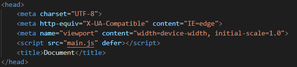

# Quick Review From Class 1
## Variables
A variable is a box that can contain a value.
For Example

    let numberOfPoints = 0;
    //  Player scores...
    numberOfPoints = numberOfPoints + 1

## If Statements
An if statement allows us to perform different actions depending on a condition.
For example:
    
    // This code runs every time the player scores
    playerScore = playerScore + 1
    if (playerScore > 5){
        console.log("Congratulations! You won.)
    }
    else if(playerScore == 4){
        console.log("Congratulations! You scored, one more goal to go.")
    }
    else{
        console.log("Congratulations! You scored.)
    }

 

# Class 2

## Goal 🥅 :
    Draw the paddles on the canvas.

## Functions 📈
A function is a chunk of code that can be run with a keyword.

    function yell(){
        console.log("Hello!");
    }

### Parameters
---
Parameters are values that you can give to a function which change or determine the behaviour of the function.

    function yell(message){
        console.log(message);
    }

### Return Values ↩️
---
Functions "Return" values. This means that when a function finishes, it can place a value into a variable.

    let firstValue = 4;
    let secondValue = 6;
    let sum = addValues(firstValue, secondValue);

    function addValues(a, b){
        result = a + b;
        return result;
    }
    
### Practical example for pong
---

    // Checks if player 1 scored.
    function didPlayer1Score(ballXPosition){
        if (ballXPosition > CANVAS_WIDTH){
            return true;
        }
        else{
            return false;
        }
    }

    // Checks if player 2 scored.
    function didPlayer2Score(ballXPosition){
        if (ballXPosition < 0){
            return true;
        }
        else{
            return false;
        }
    }

    if(didPlayer1Score() == true){
        player1Score = player1Score + 1;
    }
    else if (didPlayer2Score() == true){
        player2Score = player2Score + 1
    }

---

    // Advanced
    function didPlayer1Score(ballXPosition){
        return ballXPosition > CANVAS_WIDTH;
    }

    function didPlayer2Score(ballXPosition){
        return ballXPosition < 0;
    }

    if(didPlayer1Score(ballXPosition)){
        player1Score++;
    }
    else if (didPlayer2Score(ballXPosition)){
        player2Score++;
    }

## Loops 🔁

### While Loops

    while( CONDITION IS TRUE ){
        // Do something
    } 

    // Similar to if statements
    if ( CONDITION IS TRUE ){
        // Do Something
    }

While loops loop until the condition is false.

    let number = 0;
    while (number < 10){
        console.log(number);
        number = number + getUserInput();
    }

### For Loops
Similar to while loops, but with different syntax

    for(let i = 0; i < 4; i++){
        console.log(i);
    }

 
  
Output 

   0 
   1 
   2 
   3 

 
A while loop translated into a for loop
    
    // While loop
    let i = 0;
    while (i < 10){
        console.log(i);
        i = i + 1;
    }

    // For loop
    for(let i = 0; i < 10; i++){
        console.log(i);
    }

 
  
Output 

   0 
   1 
   2 
   3 
   4 
   5 
   6 
   7 
   8 
   9

 

## Canvas 🖌️🖼️
You may be used to this cartesian plane

 
In programming, screen coordinates look like this.
The x direction stays the same, but the y axis is flipped.

  

# 🏓 Pong 1 : Drawing the paddles.
## 🎯Step 1 - Create the project folder:
In order to begin making your program, you're going to need to start a project in Visual Studio Code. Follow the next steps to startup your project.

 

## Step 1.1:
<b>Open Visual Studio and Open a new Folder</b>

<b> If another project opens, just click on file -> Open Folder</b>

 

## Step 1.2:
Navigate to wherever you want your folder made, we recommend your Documents folder. Then create the folder and select it.
To Create a folder, right click -> new -> folder.

  

## 🎯 Step 2 - HTML

 

## Step 2.1 - Create the file.
In the new project, create a new file and call it **index.html**

 

## Step 2.2 - Add the html template.
Select the new html. In the html file, write **!** and click **enter**. Your html file should look like the following.

 

## Step 2.3 - Link the JavaScript file.
In the html file, just above the title line, enter the following line.

    

This will let the html file know that we want to add some JavaScript to this page, and the JavaScript will be in the main.js file.

 

## Step 2.4 - Link the CSS file.
Below the line you just added, add another line to link the css we'll be making in the future. This will add a bit of styling to the page.

    <link rel="stylesheet" href="style.css">

 

## Step 2.5 - Add the canvas.
The canvas is what we will use to draw on. Before we access it in JavaScript though, we need to add it to the HTML. Add the following line inside the body tags.

    <canvas></canvas>

> In case you weren't able to follow along, the full html code can be found [here](../code/Pong-1/index.html)

  

## 🎯 Step 3 - Use our CSS
Since we're tight on time, we aren't going to go into CSS in this course. 
Make a new file like you did for index.html but this time, call it **style.css** . In the contents, copy and paste the following code.

    canvas{
    display: block;
    background-color: black;
    margin: auto;
    }

    body{
        background-color: grey;
    }

If you want to learn more about CSS, visit [W3Schools](https://www.w3schools.com/css/). They have lots of amazing tutorials.

**Congrats! You've made the HTML and CSS files. Now we can move onto the JavaScript!**

  

## 🎯 Step 4 - Drawing the background.
Finally, we're going to do something related to the game. We're going to draw out first paddle. We'll start off super simple, and then introduce some better programming practices as we go.

 

## Step 4.1 - Create the JavaScript file.
Like you did before for the html and css files, create a new file but this time, call is **main.js**

 

## Step 4.2 - Get the canvas and context.
In JavaScript, we can get access to elements from the html file. To get these objects, we need to use the following code.

    let canvas = document.getElementsByTagName("canvas")[0];

How does this line work?
1. We create a variable called canvas.
2. We call the getElementsByTagName() function, passing in "canvas" as the argument. You can think of **document** as the html file. This gets a list of all the canvas elements on the html page.
3. Since there can be multiple canvases, that function returns a list of all the canvases found on the page. To get the first / only one, we add the [0] to the end. We will look at lists a bit later in the course, but this basically means *give me the first one*.
4. We now have the canvas from the html file, in the canvas variable.

One more item that we haven't spoken about is the context. What the context really is isn't important, but you can think of it as the paint brush that we use to paint onto the canvas. You'll see more what we mean later. To get the context, we need to add the following line to our code.

    let context = canvas.getContext("2d");

Now we have the canvas and context variables, the last thing we need to add is this next line.

    // Make the canvas able to recieve input
    canvas.tabIndex = 1;

This just lets the canvas recieve input. It'll be important in later classes.

 

## Step 4.3 - Set the canvas size
If you run your code with Live Server, you'll see that our canvas is quite small. If you didn't install Live Server in the first class, or forgot how to run it, see [here](./Class1.md#Installing-and-running-Live-Server) for instructions.

To fix the size issue, we'll add the following lines

    // Set the canvas dimensions
    canvas.height = 720;
    canvas.width = 1080;

This will change the canvas size to 720 pixels tall and 1080 pixels wide. Refresh your web page and you should see the difference.

  

## 🎯 Step 5 - Draw the left paddle
Now that we have the canvas and the context, drawing is actually very simple. Using a function called fillRect(), we can draw rectangles on the canvas. To draw the left paddle, add the following line to your code.

    // Draw the left paddle
    context.fillStyle = "white";
    context.fillRect(0, 0, 30, 175);

If you refresh, you should see that you drew your very own paddle on the screen!

> What do these lines do exactly?

The first line, context.fillStyle = "white" is setting up the colour of our rectangle. It means that any time we draw something that's filled in, make the infill white. Feel free to change this to another colour and see the paddle colour change.

The second line, context.fillRect(0, 0, 30, 175) is a bit more complicated but still fairly simple. This is the line which draws the rectangle. The parameters are in the following order (xPosition, yPosition, width, height). It may also be helpful to imagine what the function would look like.

    function fillRect(xPosition, yPosition, width, height){
        ...
    }

Go ahead and mess with the values to see how the rectangle moves around or stretches based on the values you input. 

You might notice that the paddle is being drawn relative the top left corner. Just like how the canvas starts at (0, 0) in the top left corner, everything we write or draw starts in the top left corner as well.

 

## Step 5.1 - Refactor our code.
Our code is working, but it'll be much easier to work with later on if we change a couple things. We're going to add some constant variables to our code so that we don't have random numbers everywhere.
> Constants are variables that never change value. We use them so that our code is more readable. It's very difficult to understand what 30 is in the fillRect function right now, but in a minute it will be much easier to understand. We also want to store the value so that if every we tweak a value, we can just tweak it once when we make the variable, instead of every time we use it.

Replace all your code below canvas.tabIndex = 1; with the following.

    // Create the canvas constants and set the dimensions
    const CANVAS_HEIGHT = 720;
    const CANVAS_WIDTH = 1080;
    canvas.height = CANVAS_HEIGHT;
    canvas.width = CANVAS_WIDTH;

    // Create the paddle constants
    const PADDLE_COLOUR = "white"
    const PADDLE_WIDTH = 30;
    const PADDLE_HEIGHT = 175;

    context.fillStyle = PADDLE_COLOUR;

    // Draw the left paddle
    context.fillRect(0, 0, PADDLE_WIDTH, PADDLE_HEIGHT);

Now, it's much easier to see what the width and height values represent.

  

## Step 6 - Draw the Right Paddle (Challenge)
If you've gotten this far, hopefully you understand more or less how the drawing is working. As a challenge, try to draw the right paddle at the bottom right of the screen. Remember that the paddle is being drawn from the top left, so you'll need to apply an offset.

 
  
Hint 1

   <b>We have variables for the canvas height and width, so we can use those to draw the paddle at the bottom right. Because the paddle is drawn from the top left, it will be drawn off the screen if you simply draw it at CANVAS_WIDTH, CANVAS_HEIGHT. The next hint will tell you the x position to draw the paddle at.</b>

 

 
  
Hint 2 - Paddle x

    The x position to be drawn at is CANVAS_WIDTH - PADDLE_WIDTH. 
    This should help you figure out the solution to the y position.
    The next hint will show you the y position.

 

 
  
Hint 3 - Paddle y

   CANVAS_HEIGHT - PADDLE_HEIGHT

 

 
  
Solution

   context.fillRect(CANVAS_WIDTH - PADDLE_WIDTH, CANVAS_HEIGHT - PADDLE_HEIGHT, PADDLE_WIDTH, PADDLE_HEIGHT);

 
Congrats! You just made the beginnings of your first ever game. 🙂
If you struggled to follow along, don't worry. The completed code can be found [here](../code/Pong-1/pong.js)

   

# 🖌️ (Optional) At Home Exercise: Draw onto the Canvas 🖼️
### 🎯Step 0 :
What we did last class.
Code is available on GitHub [here](https://github.com/jeffbrin/JACMiniCourse/tree/main/Previous%20Classes%20Code/Class%201).
Look Under 'Previous Classes Code' Folder

### 🎯Step 0.5:
In order to be able to properly use the canvas we have to add a few lines of code and store the canvas's context into a variable.

    const context = canvas.getContext('2d');
    canvas.tabIndex = 1;

🗒️*Note **const** is another reserved key word used to declare a variable (like **let**) however once a value is assign to it, it cannot be changed*

### 🎯Step 1:
We have our canvas in the HTML and we have a variable that is storing that HTML object. We now want to resize the canvas in order to make it bigger to better suit our needs.

In order to do so we will access two properties on the canvas variable we have:

1. canvas.width
2. canvas.height
   
Let us set them to a specific resolution:

1280x720 (commonly known as 720p)

    canvas.width = 1280;
    canvas.height = 720;

### 🎯Step 2:
Now that we have it sized the way we want, let us find a way to draw something onto the canvas.

In order to do this we will use the **context** variable we declared earlier.

The context variable is storing the 2d representation of what is inside the canvas.

    context.font = '40px Arial';
    context.fillText("Hello World", canvas.width / 2 - 50 canvas.height / 2 - 50);
We choose **canvas.width / 2** and **canvas.height / 2** in order to have it relatively center.

### 🎯Step 3:
In a game we need to capture the player's input ⌨️.

We will be doing something whenever the user presses the spacebar (denoted by ' ')

In order to do this we need to add something called an **Event Listener** 👂.

An event listener attaches to a specific HTML object and will 'listen' for events which then gives us the ability to 'react' to them. Some examples of events are:

1. onclick 🖱️
2. onmouseover 🖱️
3. onload ⌛
4. onkeydown ⌨️
5. keypress ⌨️

We will be using the last one called 'keypress'. This means that when the user presses down a key the listener will trigger giving us an opportunity to do something with this key press.

    canvas.addEventListener('keypress', handleKeyPress);

The **handleKeyPress** argument being passed into the function is a function that indicates to the event listener which function to call when the event happens.

❗One last thing we want to do is keep track of the number of times the user presses on the spacebar key.

In order to do this we will create a variable called clicksCount.

This is a variable that serves a specific purpose and it is called a 'counter' in programming. It is called this because it increments by one every time.

    let clicksCount = 0;
Add that line before adding the event listener to the canvas variable.

Your Code should look something like this:

    const canvas = document.getElementsByTagName('canvas')[0];
    const context = canvas.getContext('2d');

    canvas.tabIndex = 1;

    canvas.width = 1280;
    canvas.height = 720;
    
    let clicksCount = 0;

    canvas.addEventListener('keypress', handleKeyPress);

### 🎯Step 4
We will now create the **handleKeyPress** function.

In this function we want to make sure that the key that triggered the keypress event was the spacebar key.

    function handleKeyPress(event)
    {
        if (event.key == ' ')
        {
            clicksCount++;
            context.font = '40px Arial';
            context.fillText(clicksCount, canvas.width / 2 - 50, canvas.height / 2 - 50);
        }
    }
Add this code under the code written earlier.

⚒️ Breaking down the code ⚒️
---
We have a function that takes in an event as a parameter.

This event is an object that contains properties, just like canvas except the properties are different.

We will check if event.key was the spacebar key (denoted by ' ').

If this expression evaluates to true then we know the user pressed the spacebar and we will proceed into the if statement.

🗒️ *Note if the user presses a different key, the function is still called, except nothing happens*

Once inside the if statement body we will increment clicksCount, we will set the font to 40 pixels in size and the font is Arial.

Next is where we draw to the screen like we did earlier.

🐛 However there is a Bug 🐛
---
The function just keeps on getting called and the numbers just keep on getting drawn over eachother creating a mess.

In order to fix this bug we have to clear the canvas before redrawing the text.

This happens so fast that we can't perceive it and it gives the illusion of being a smooth transition.

Add this line of code inside the function before the context.fillStyle() line:

    context.clearRect(0, 0, canvas.width, canvas.height);

The function will now look like:

    function handleKeyPress(event)
    {
        if (event.key == ' ')
        {
            clicksCount++;
            context.clearRect(0, 0, canvas.width, canvas.height);
            context.font = '40px Arial';
            context.fillText(clicksCount, canvas.width / 2 - 50, canvas.height / 2 - 50);
        }
    }

