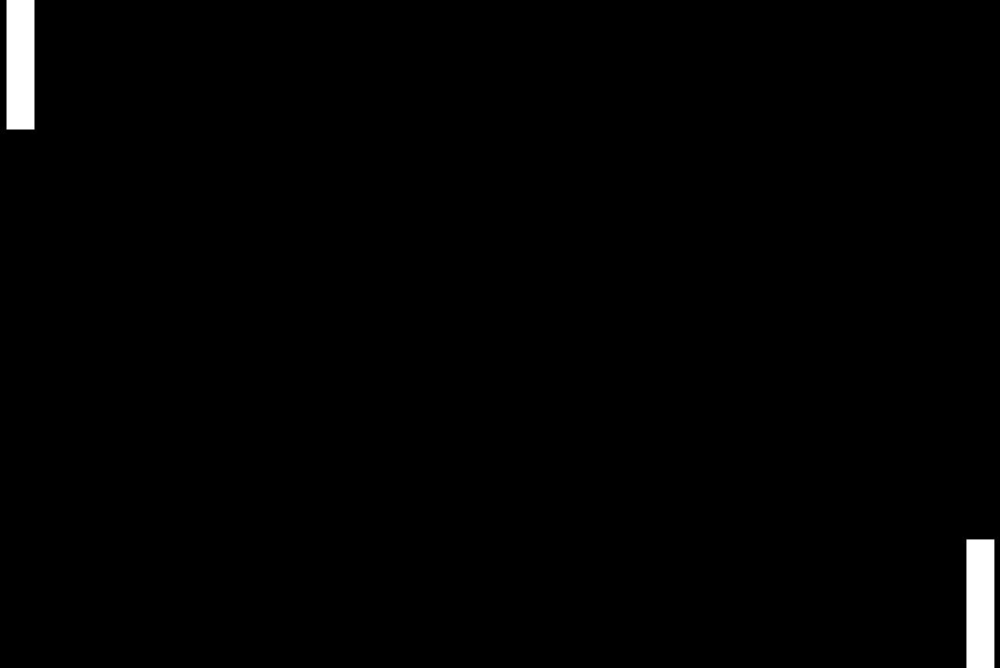
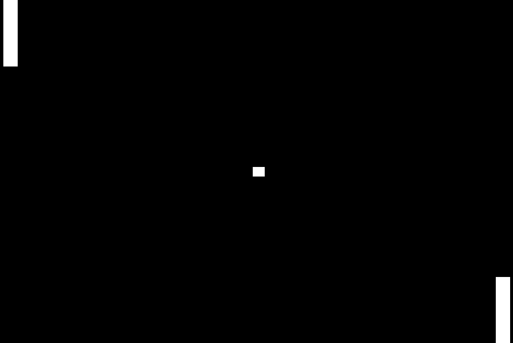
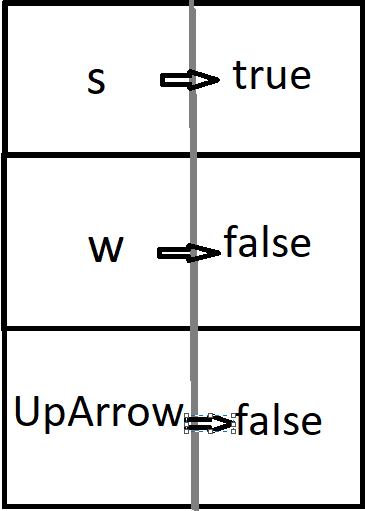

# Class 3

## Goal 🥅 :
### Receive Input from the keyboard to move the paddle

## Game Loop
Receive Input -> Update the Game Logic -> Render on the screen


## Delta Time (dt)
We must scale all of our values with delta time in order for the game logic to behave the same on every computer.

### 60 FPS
Every frame updates then renders every 0.0167 Seconds or 16.7ms


### 30 FPS
Every frame updates then renders every 0.0333 Seconds or 33.3ms

## The First Gif is simulating the game at 30 FPS, second is 60 FPS



In both of these the ball is moving at 100 pixels * the framerate per update function call. Think of it like telling someone to move 1 meter per second 30 times in a second vs. telling someone to move 1 meter per second 60 times in a second. The person moving 60 times will move faster.
We want to avoid tying the physics to the framerate by using delta time.

```js
// Old
function update() {
    ball.x += 10; 
    // Every frame, move the ball 10 pixels to the right.
}

// New
function update(dt) {
    ball.x += 10 * dt; 
    // Every frame, move the ball (10 * dt) pixels to the right.
}
```

## So what is delta time?
Very simple it is the time elapsed between the previous frame and the current frame.

## Clearing the canvas before rendering
We have to clear the canvas every time right before we render. This will give the illusion of movement.

### What if we don't clear?
Well...
<br>




<br><br>

---


<br><br>

## Moving Paddles! 🏓

### Step 0: Download Pong 2 from GitHub
---

Make sure you have the code downloaded from last week if you weren't there. Or continue with your code if you were able to get to the end of last week's tutorial.

### Step 1: How to tell which key is being pressed?
---
In a game we need to capture the player's input ⌨️.

We will be doing something whenever the user presses the **W, S, UpArrow, DownArrow keys**

In order to do this we need to add something called an **Event Listener** 👂.

Events are built in to JavaScript and you can read up more on them [here](https://www.w3schools.com/js/js_events.asp)

An event listener attaches to a specific HTML object and will 'listen' for events which then gives us the ability to 'react' to them. Some examples of events are:

1. onclick 🖱️
2. onmouseover 🖱️
3. onload ⌛
4. keydown ⌨️
5. keyup ⌨️

We will be using the last ones called 'keydown' and 'keyup'. This means that when the user presses down a key the listener will trigger giving us an opportunity to do something with this key press. We will make the *handleKeyPressDown* and *handleKeyPressUp* functions later. Add these lines of code to your script.

```js
canvas.addEventListener('keydown', handleKeyPressDown);
canvas.addEventListener('keyup', handleKeyPressUp);
```

The **handleKeyPress** argument being passed into the function is a function that tells the event listener which function to call when the event happens.
<br> These are called **Callback Functions**.

### Step 2: We need add something to keep track of the keypresses
---
Create this variable at the top of your JavaScript file. *keys* will allow us to keep track of which keys are currently being held down. Near the top of your script, create this variable.

```js
const keys = {};
```


### Step 3: We need to create the handleKeyPress functions
---
The functions for handling keys being pressed down or lifted are very simple. The following image demonstrates a way you could picture the keys object.

 

It is used to store a value related to an input, so if we enter "s", we will receive a value associated with "s", in this case -> true. In this function, we set the value to true if a key is pressed down, and false if the key is lifted. We will use the values later to move the paddle. Add these functions at the bottom of your script.

```js
function handleKeyPressDown(event){
    keys[event.key] = true;
}
function handleKeyPressUp(event){
    keys[event.key] = false;
}
```

### Step 4: Implement the Game Loop 🔁
---
Let's add the game loop to the program. 
Add the following variable at the bottom of your code.
```js
let lastTime = 0
```

Then add the following functions below that variable.

```js
// Function called every frame
function GameLoop(currentTime = 0)
{
    // Divide by 1000 to go from ms to s
    const deltaTime = (currentTime - lastTime) / 1000;
    lastTime = currentTime;

    // Update logic
    update(deltaTime);
    render();

    requestAnimationFrame(GameLoop);
}

// Update the game logic.
function update(deltaTime)
{

}

// Display the game logic
function render()
{

}
```

**Breaking Down the GameLoop()**

GameLoop is a function which represents the game loop we described above. It starts by calculating the amount of time that has passed since the last call. Then, is sets last time to the current time so that the next function can calculate the elapsed time again.

After getting the elapsed time, it calls the update function which handles any logic. In our case, the update will change the location of the paddles, the ball, and check for goals.

Then the render is called which is what is going to draw to the screen.

*requestAnimationFrame(GameLoop)* is outside the scope of this course, but basically, it calls the GameLoop function again, with the new current time. This allows the game to "Loop" without actually having a loop. It is built in to JavaScript, we did not create this function. If you are curious and want to learn more click this [link](https://developer.mozilla.org/en-US/docs/Web/API/window/requestAnimationFrame).

### Step 5: Move the paddle drawing logic into render()
---
Move the code responsible for drawing the paddle into render. If you're using our code, your render function will look like this.

```js
// Display the game logic
function render()
{
    // Draw the left paddle
    context.fillRect(0, 0, PADDLE_WIDTH, PADDLE_HEIGHT);

    // Draw the right paddle
    context.fillRect(CANVAS_WIDTH - PADDLE_WIDTH, CANVAS_HEIGHT - PADDLE_HEIGHT, PADDLE_WIDTH, PADDLE_HEIGHT);
}
```

Then, at the top of the render function, add this line. This will clear the screen before we redraw, preventing the weird rendering behaviour we showed before.

```js
// Clear the screen
context.clearRect(0, 0, CANVAS_WIDTH, CANVAS_HEIGHT);
```

This is perfect for static paddles, but if we want them to move, we will need to store their positions in a variable so we can change them. Add these variables at the top of your program.

```js
// Store paddle positions
let player1Y = 0;
let player2Y = CANVAS_HEIGHT - PADDLE_HEIGHT;
```

Then, change your render to use those variables for the y positions of the fillRect function calls.
```js
// Display the game logic
function render()
{
    // Clear the screen
    context.clearRect(0, 0, CANVAS_WIDTH, CANVAS_WIDTH);

    // Draw the left paddle
    context.fillRect(0, player1Y, PADDLE_WIDTH, PADDLE_HEIGHT);

    // Draw the right paddle
    context.fillRect(CANVAS_WIDTH - PADDLE_WIDTH, player2Y, PADDLE_WIDTH, PADDLE_HEIGHT);
}
```
Now, when the value of player1Y or player2Y changes, the paddle will move with it. If you run your project, everything should look the same as before.

### Step 6: Left Paddle Movement 🏓
---
We already have the canvas listening for keys, so now we can use the key values to move the paddles.

Near the top of your script, add a new constant called PADDLE_SPEED. This will be the number of pixels per second that our paddles will move. Feel free to mess with this value.

```js
const PADDLE_SPEED = 400;
```

In update, we'll check to see if keys.w is true. If it is, it means that the "w" key is being held down. Then, we'll move the paddle up by changing the player1Y position. We are subtracting from the player1Y because the coordinates are flipped. See [here](./Class2.md#canvas-🖌️🖼️) for a refresher.

```js
function update(dt){
    // Player 1 movement.
    if (keys.w) {
        // Subtract paddle speed from current Y scaled by deltaTime.
        player1Y -= PADDLE_SPEED * dt;
    }
    else if (keys.s) {
        // Add paddle speed to current Y scaled by deltaTime.
        player1Y += PADDLE_SPEED * dt;
    }
}
```
### Step 7: We Have a Bug! 🐛
---
If you hold up for long enough, you'll see that we don't have anything stopping our paddle from leaving the screen. We want to stop that.

It's very simple to prevent this behaviour. We just want to check if the player1Y position is less than 0. If it is, then we simply set it back to 0. Because render is called after update(), we know that the paddle will never be rendered at a value less than 0. The same is true for going down, but instead we check if the player1Y is greater than the canvas height - the paddle height, since we don't want any part of the paddle leaving the canvas.

```js
function update(dt){
    // Player 1 movement.
    if (keys.w) {
        // Subtract paddle speed from current Y scaled by deltaTime.
        player1Y -= PADDLE_SPEED * dt;
        if (player1Y < 0){
            player1Y = 0;
        }
    }
    else if (keys.s) {
        // Add paddle speed to current Y scaled by deltaTime.
        player1Y += PADDLE_SPEED * dt;
        if (player1Y > CANVAS_HEIGHT - PADDLE_HEIGHT){
            player1Y = CANVAS_HEIGHT - PADDLE_HEIGHT;
        }
    }
}
```
Now, if you try to leave the screen, you'll see that the paddle is clamped to the top and bottom of the screen.
	
### 🎯 Step 8: Challenge - Right Paddle Movement
---
Now, try to implement the right paddle. The code should be pretty similar to the left paddle. Make sure you add your code to update!

One important hint for free - To get the value of the up and down arrows, use `keys.ArrowUp` and `keys.ArrowDown`.

<details> 
  <summary>Hint</summary>
   Change the value of player2Y to change the position of paddle 2.
</details>
<details>
    <summary>Hint 2</summary>
    Remember that drawing starts from the TOP LEFT corner.
</details>

<details> 
  <summary>Solution</summary>
Add this code to your update function.

```js
// Player 2 movement.
if (keys.ArrowUp) {
    // Subtract paddle speed from current Y scaled by deltaTime.
    player2Y -= PADDLE_SPEED * dt;
    if (player2Y < 0){
        player2Y = 0;
    }
}
else if (keys.ArrowDown) {
    // Add paddle speed to current Y scaled by deltaTime.
    player2Y += PADDLE_SPEED * dt;
    if (player2Y > CANVAS_HEIGHT - PADDLE_HEIGHT){
        player2Y = CANVAS_HEIGHT - PADDLE_HEIGHT;
    }
}
```

</details>

## Final Product
The final code for today can be found [here](../code/Pong-2/pong.js)